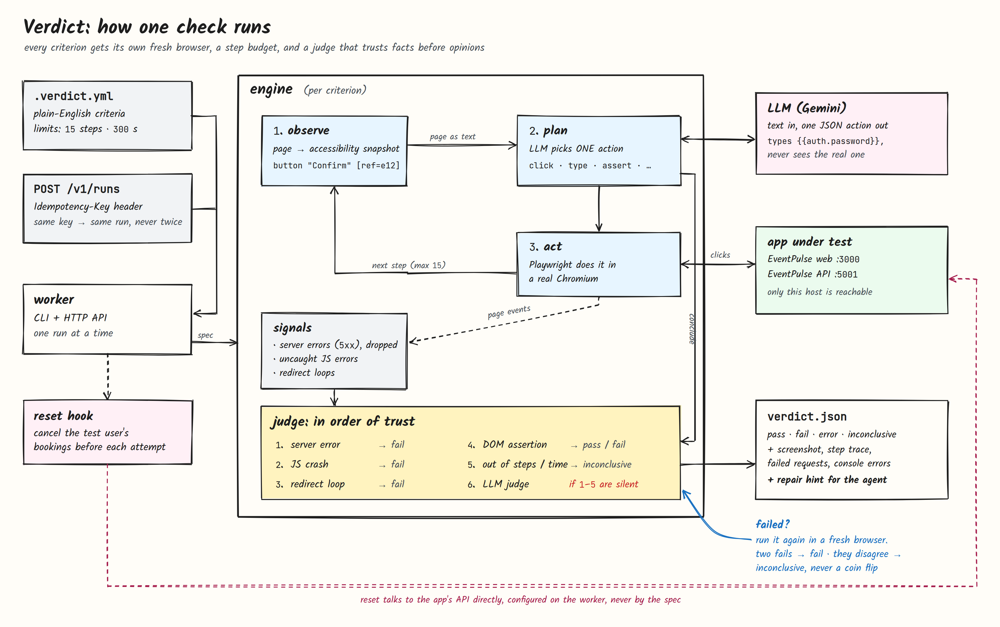

# Verdict

**Browser verification for coding agents.** Verdict opens a web app in a real browser, checks it against plain-English acceptance criteria, and returns a structured verdict (per criterion: `pass`, `fail`, `error` or `inconclusive`, with evidence and a repair hint) that a coding agent can act on without a human.

> Coding agents produce changes faster than anyone can verify them. A green CI run proves the code compiles and the unit tests pass, not that the feature behaves as the task intended. Verdict turns "someone should click through this" into a step inside the agent loop: **verify → diagnose → hand back a repair hint → re-run.**

**Status:** Milestones 1–3 complete: Verdict runs on every EventPulse pull request, and on a real PR it caught a planted booking bug that compiled, deployed and passed CI. See the [roadmap](#roadmap).

---

## How it works

Each criterion runs as a bounded **observe → act → judge** loop in a fresh Chromium context:

1. **Observe:** the page becomes compact, structured text (Playwright's accessibility snapshot, with a reference on every element).
2. **Act:** an LLM picks the next action from a closed set: `navigate`, `click`, `type`, `select`, `wait_for`, `assert`. Playwright executes it. There is no free-form code execution.
3. **Judge:** in a fixed order of trust. Hard facts decide before the model is ever asked:

| Order | Signal | Example | Decides alone? |
|---|---|---|---|
| 1 | Network | `POST /api/bookings` returns 500 | Yes → `fail` |
| 2 | Console | Uncaught `TypeError` after a click | Yes → `fail` |
| 3 | Redirect loop | One click bounces `/login` ↔ `/events` | Yes → `fail` |
| 4 | DOM assertion | "Booking Confirmed!" is visible | Yes → `pass` / `fail` |
| 5 | Step budget / timeout | No decision in 15 steps | Yes → `inconclusive` |
| 6 | LLM judgment | "The confirmation is clearly shown" | Only when 1–5 are silent |

The agent that drives the browser never grades itself: the LLM judge is a separate call, made only when every deterministic signal is silent.



### Four results, on purpose

| Result | Meaning | Exit code |
|---|---|---|
| `pass` | The app does what the criterion says | `0` |
| `fail` | The app is wrong: a hard signal, a failed assertion or the judge said so | `1` |
| `error` | Verdict or its infrastructure broke, **not the app**. Don't change code for this | `2` |
| `inconclusive` | No decision within the step budget or timeout | `3` |

Keeping `error` separate from `fail` stops an agent from "fixing" correct code because a browser crashed or an LLM provider was down.

### Trustworthy failures

- **A failure must reproduce.** A failed criterion is re-run once in a fresh browser. Fail + fail → `fail`; if the second attempt disagrees, the result is `inconclusive` with both observations, never a silent pick.
- **Transient steps retry once** (element detached, navigation race) before the agent hears about it.
- **Clean test data every attempt.** A reset hook runs before each attempt (for EventPulse: cancel the test user's bookings), configured on the worker, never by the spec a pull request controls.
- **Throttling isn't a bug.** If the app rate-limits the test run (HTTP 429), a non-pass becomes `error`, not `fail`.

---

## Example

**Task spec** (`.verdict.example.yml`). Secrets come from environment variables, never from the file:

```yaml
version: 1
task: ENG-204 Ticket booking
base_url: ${PREVIEW_URL}
auth:
  email: ${VERDICT_TEST_EMAIL}
  password: ${VERDICT_TEST_PASSWORD}
criteria:
  - id: book-ticket
    check: A logged-in user can book one ticket for "Verdict Demo Night" and sees a confirmation.
limits:
  max_steps_per_criterion: 15
  timeout_seconds: 300
```

**Verdict**, from a real run against [EventPulse](https://github.com/Tanishq67m/event-Manager) running locally:

```json
{
  "run_id": "run_eff89efc",
  "status": "pass",
  "commit": null,
  "summary": { "passed": 1, "failed": 0, "error": 0, "inconclusive": 0 },
  "criteria": [
    {
      "id": "book-ticket",
      "result": "pass",
      "expected": "\"Booking Confirmed!\" is visible",
      "observed": "\"Booking Confirmed!\" is visible",
      "failing_step": null,
      "evidence": {
        "screenshot_url": "file:///…/artifacts/run_eff89efc/book-ticket-step10.png",
        "trace_url": null,
        "console_errors": [],
        "failed_requests": []
      },
      "repair_hint": null
    }
  ],
  "cost": { "llm_tokens": 21192, "usd": 0.007625 },
  "duration_ms": 29128
}
```

On its own, the agent signed in, found the event, selected the free ticket tier, booked, and confirmed the result with a DOM assertion (10 steps). The full step log is in [`NOTES.md`](NOTES.md).

### Measured so far

Three-criterion task (`book-ticket`, `seat-count`, `sold-out`) against EventPulse running locally, 3 consecutive runs on a clean build:

| Metric | Value |
|---|---|
| Results | 9/9 pass, same status on every run |
| Decided by | DOM assertion in all 9 (LLM judge never needed) |
| Duration | 99–109 s per run (mean 104.8 s) |
| Cost | $0.024–$0.026 per run (mean $0.0249) at Gemini's published paid price; actual spend $0 on the free tier |
| False fails | 0 across all 27 criterion results in the development runs, including runs hit by provider outages and rate limits (reported as `error`, never `fail`) |

**On a real pull request** (EventPulse PR #1, GitHub Actions): a PR that crashed booking for first-time users (`null` from `localStorage`) turned the check red. `book-ticket` and `seat-count` failed on the uncaught `TypeError` at "Confirm Booking", decided by the console signal and confirmed by a second fresh-browser attempt; `sold-out` passed. The Vercel preview for the same commit was green. After the one-line fix, the same PR comment flipped to 3/3 pass. Clean `main`: 3/3 pass in 78 s for $0.021. Details in [`NOTES.md`](NOTES.md#milestone-3-the-pull-request-loop).

Catch rate across many seeded bugs comes from the Milestone 4 benchmark.

No number in this README is estimated. Benchmark results will be added only from `bench/results/`.

---

## Quickstart

Requirements: Node ≥ 20.12, pnpm 12 (`npm i -g pnpm@12.5.1`), a free [Google AI Studio](https://aistudio.google.com) API key.

```bash
pnpm install && pnpm setup:browsers        # dependencies + Chromium
cp .env.example .env                        # add GEMINI_API_KEY and test credentials
pnpm verdict run --spec .verdict.example.yml --url http://localhost:3000 > verdict.json
```

stdout carries only the verdict JSON; structured JSON logs (one line per step, tagged with `run_id`) go to stderr. Screenshots and step traces are written to `artifacts/<run_id>/`.

**HTTP API** (task in, verdict out):

```bash
pnpm api                                    # listens on 127.0.0.1:8787, key from VERDICT_API_KEY

curl -X POST localhost:8787/v1/runs \
  -H "Authorization: Bearer $VERDICT_API_KEY" \
  -H "Idempotency-Key: event-Manager:a1b2c3d:spec-v1" \
  -H "Content-Type: application/json" \
  -d '{"spec": { …same fields as .verdict.yml… }, "commit": "a1b2c3d"}'
# → 202 { "run_id": "run_…", "status": "queued" }

curl localhost:8787/v1/runs/run_… -H "Authorization: Bearer $VERDICT_API_KEY"
# → { "status": "done", "verdict": { … } }
```

The same `Idempotency-Key` with the same body returns the existing run (a retried webhook never starts a second browser run); the same key with a different body is a `409`. Credentials in the request are used in memory and never written to disk.

| Command | What it does |
|---|---|
| `pnpm test` | Unit tests: no browser, no network, no API key |
| `pnpm test:e2e` | Real Chromium against a local fixture app with switchable bugs and a scripted LLM |
| `pnpm typecheck` | Strict TypeScript across the workspace |

Options: `--criterion <id>` (repeatable), `--commit <sha>`, `--artifacts-dir <dir>`, `--headed`. Configuration: `GEMINI_MODEL`, `GEMINI_THINKING_LEVEL`, `VERDICT_LOG_LEVEL` (see `.env.example`).

---

## On every pull request (GitHub Action)

Verdict ships as a GitHub Action. The app's own workflow builds the PR's code (database, API, web) inside the runner and hands the URL to Verdict, so every PR is verified against its own backend too, with nothing to host.

```yaml
- uses: Tanishq67m/Verdict-AlanAI/action@main
  with:
    url: http://localhost:3000
    gemini-api-key: ${{ secrets.GEMINI_API_KEY }}
```

- **A check** that fails when a criterion fails (`fail-on`, default `fail`).
- **One PR comment, updated in place** on every push: results, what Verdict saw, and repair hints.
- **A self-contained HTML report** (every step, screenshots inlined) uploaded as the `verdict-report` artifact.
- **`only-failed: true`** re-checks only what failed last time and carries earlier passes over, labelled with the commit they came from.

See [`action/README.md`](action/README.md) and EventPulse's [workflow](https://github.com/Tanishq67m/Event-Manager/blob/main/.github/workflows/verdict.yml) for a complete setup.

---

## Safety

Verdict drives a real browser against pages it doesn't control, with test credentials, so these are built in rather than bolted on:

- **Credentials never reach the LLM.** The model types `{{auth.email}}` / `{{auth.password}}`; the executor substitutes real values inside the browser only. Page text that echoes a secret is redacted back to the placeholder before the model sees it.
- **Redaction everywhere.** Logs, step traces and the verdict pass through a redactor (raw, URL-encoded and JSON-escaped forms, plus bearer tokens and JWTs). An end-to-end test scans every prompt and artifact for the real credentials.
- **Prompt-injection defence.** Page content is passed as data inside a single delimited block, delimiter look-alikes are neutralised, and the system prompts forbid following instructions found in page content. Even a fooled model can only choose from the closed action set.
- **Egress allowlist.** The browser may only visit the app's own host; navigation elsewhere (e.g. `169.254.169.254`) is blocked and reported.
- **Scoped signals.** Only server errors and app-origin exceptions decide alone; third-party noise and 4xx responses are logged, never decisive, to keep false fails down.
- **Hard limits** from the spec schema: ≤ 10 criteria, ≤ 15 steps per criterion, ≤ 300 s per run, plus a watchdog that kills a hung browser context.

---

## Project layout

```text
verdict/
├── apps/
│   ├── worker/               CLI (`pnpm verdict run`), shared runner, test-data reset
│   └── api/                  HTTP API (`pnpm api`): runs, idempotency, API key
├── packages/
│   ├── schema/               zod: task spec v1 + verdict v1, YAML loader
│   ├── engine/
│   │   ├── observe/          Observer interface + accessibility-snapshot observer
│   │   ├── actions/          closed action set: schema + executor
│   │   ├── signals/          network/console collector, in-flight request tracker
│   │   ├── judge/            hybrid judge
│   │   ├── security/         redaction, credential placeholders, egress allowlist
│   │   └── loop.ts, run.ts   bounded loop, evidence, verdict assembly
│   └── llm/                  provider-agnostic client, Gemini, token + cost accounting
├── docs/                     PRD and design plan
├── .verdict.example.yml
└── NOTES.md                  per-milestone notes with real output
```

TypeScript end to end, strict mode, zod at every boundary (spec in, LLM reply in, verdict out).

---

## Roadmap

- [x] **Milestone 1:** one criterion, locally: schemas, observe → act → judge loop, hybrid judging, evidence, CLI, unit + e2e tests, a real run
- [x] **Milestone 2:** full task (3 criteria), flake handling (retry, fresh-browser rerun, disagreement → `inconclusive`), test-data reset, redirect-loop detection, HTTP API with idempotency keys
- [x] **Milestone 3:** GitHub Action on EventPulse pull requests: EventPulse runs inside CI for the PR's commit, a check status, one PR comment updated in place, a static HTML run report, re-run failed criteria only
- [ ] **Milestone 4:** seeded-bug benchmark on EventPulse (6 bugs × 3 runs, clean main × 5): catch rate, false-fail rate, stability, p50/p95 latency, cost per run

## Documentation

- [`docs/PRD.md`](docs/PRD.md): product requirements
- [`docs/PLAN.md`](docs/PLAN.md): design notes, findings, and the deliberate changes to the PRD
- [`NOTES.md`](NOTES.md): what was built and verified in each milestone, with real output
