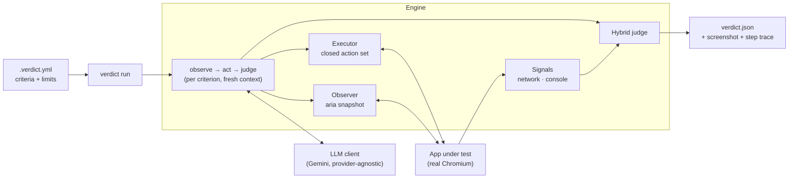

# Verdict

**Browser verification for coding agents.** Verdict opens a web app in a real browser, checks it against plain-English acceptance criteria, and returns a structured verdict (per criterion: `pass`, `fail`, `error` or `inconclusive`, with evidence and a repair hint) that a coding agent can act on without a human.

> Coding agents produce changes faster than anyone can verify them. A green CI run proves the code compiles and the unit tests pass, not that the feature behaves as the task intended. Verdict turns "someone should click through this" into a step inside the agent loop: **verify → diagnose → hand back a repair hint → re-run.**

**Status:** Milestone 1 of 4 complete: single-criterion runs from the CLI, verified against a real app. See the [roadmap](#roadmap).

---

## How it works

Each criterion runs as a bounded **observe → act → judge** loop in a fresh Chromium context:

1. **Observe:** the page becomes compact, structured text (Playwright's accessibility snapshot, with a reference on every element).
2. **Act:** an LLM picks the next action from a closed set: `navigate`, `click`, `type`, `select`, `wait_for`, `assert`. Playwright executes it. There is no free-form code execution.
3. **Judge:** in a fixed order of trust. Hard facts decide before the model is ever asked:

| Order | Signal | Example | Decides alone? |
|---|---|---|---|
| 1 | Network | `POST /api/bookings` returns 500 | Yes → `fail` |
| 2 | Console | Uncaught `TypeError` after a click | Yes → `fail` |
| 3 | DOM assertion | "Booking Confirmed!" is visible | Yes → `pass` / `fail` |
| 4 | Step budget / timeout | No decision in 15 steps | Yes → `inconclusive` |
| 5 | LLM judgment | "The confirmation is clearly shown" | Only when 1–4 are silent |

The agent that drives the browser never grades itself: the LLM judge is a separate call, made only when every deterministic signal is silent.



### Four results, on purpose

| Result | Meaning | Exit code |
|---|---|---|
| `pass` | The app does what the criterion says | `0` |
| `fail` | The app is wrong: a hard signal, a failed assertion or the judge said so | `1` |
| `error` | Verdict or its infrastructure broke, **not the app**. Don't change code for this | `2` |
| `inconclusive` | No decision within the step budget or timeout | `3` |

Keeping `error` separate from `fail` stops an agent from "fixing" correct code because a browser crashed or an LLM provider was down.

---

## Example

**Task spec** (`.verdict.example.yml`). Secrets come from environment variables, never from the file:

```yaml
version: 1
task: ENG-204 Ticket booking
base_url: ${PREVIEW_URL}
auth:
  email: ${VERDICT_TEST_EMAIL}
  password: ${VERDICT_TEST_PASSWORD}
criteria:
  - id: book-ticket
    check: A logged-in user can book one ticket for "Verdict Demo Night" and sees a confirmation.
limits:
  max_steps_per_criterion: 15
  timeout_seconds: 300
```

**Verdict**, from a real run against [EventPulse](https://github.com/Tanishq67m/event-Manager) running locally:

```json
{
  "run_id": "run_eff89efc",
  "status": "pass",
  "commit": null,
  "summary": { "passed": 1, "failed": 0, "error": 0, "inconclusive": 0 },
  "criteria": [
    {
      "id": "book-ticket",
      "result": "pass",
      "expected": "\"Booking Confirmed!\" is visible",
      "observed": "\"Booking Confirmed!\" is visible",
      "failing_step": null,
      "evidence": {
        "screenshot_url": "file:///…/artifacts/run_eff89efc/book-ticket-step10.png",
        "trace_url": null,
        "console_errors": [],
        "failed_requests": []
      },
      "repair_hint": null
    }
  ],
  "cost": { "llm_tokens": 21192, "usd": 0.007625 },
  "duration_ms": 29128
}
```

On its own, the agent signed in, found the event, selected the free ticket tier, booked, and confirmed the result with a DOM assertion (10 steps). The full step log is in [`NOTES.md`](NOTES.md).

### Measured so far

| Metric | Value | Notes |
|---|---|---|
| Real runs | 1 (`book-ticket`, clean build) | Catch rate and stability come from the seeded-bug benchmark (Milestone 4) |
| Duration | 29.1 s | 10 steps, 9 LLM calls |
| Tokens | 21,192 | `gemini-3.5-flash-lite` |
| Cost | $0.0076 | Tokens × Gemini's published paid price; actual spend $0 on the free tier |
| Decided by | DOM assertion | LLM judge not called |

No number in this README is estimated. Benchmark results will be added only from `bench/results/`.

---

## Quickstart

Requirements: Node ≥ 20.12, pnpm 12 (`npm i -g pnpm@12.5.1`), a free [Google AI Studio](https://aistudio.google.com) API key.

```bash
pnpm install && pnpm setup:browsers        # dependencies + Chromium
cp .env.example .env                        # add GEMINI_API_KEY and test credentials
pnpm verdict run --spec .verdict.example.yml --url http://localhost:3000 > verdict.json
```

stdout carries only the verdict JSON; structured JSON logs (one line per step, tagged with `run_id`) go to stderr. Screenshots and step traces are written to `artifacts/<run_id>/`.

| Command | What it does |
|---|---|
| `pnpm test` | Unit tests: no browser, no network, no API key |
| `pnpm test:e2e` | Real Chromium against a local fixture app with switchable bugs and a scripted LLM |
| `pnpm typecheck` | Strict TypeScript across the workspace |

Options: `--criterion <id>` (repeatable), `--commit <sha>`, `--artifacts-dir <dir>`, `--headed`. Configuration: `GEMINI_MODEL`, `GEMINI_THINKING_LEVEL`, `VERDICT_LOG_LEVEL` (see `.env.example`).

---

## Safety

Verdict drives a real browser against pages it doesn't control, with test credentials, so these are built in rather than bolted on:

- **Credentials never reach the LLM.** The model types `{{auth.email}}` / `{{auth.password}}`; the executor substitutes real values inside the browser only. Page text that echoes a secret is redacted back to the placeholder before the model sees it.
- **Redaction everywhere.** Logs, step traces and the verdict pass through a redactor (raw, URL-encoded and JSON-escaped forms, plus bearer tokens and JWTs). An end-to-end test scans every prompt and artifact for the real credentials.
- **Prompt-injection defence.** Page content is passed as data inside a single delimited block, delimiter look-alikes are neutralised, and the system prompts forbid following instructions found in page content. Even a fooled model can only choose from the closed action set.
- **Egress allowlist.** The browser may only visit the app's own host; navigation elsewhere (e.g. `169.254.169.254`) is blocked and reported.
- **Scoped signals.** Only server errors and app-origin exceptions decide alone; third-party noise and 4xx responses are logged, never decisive, to keep false fails down.
- **Hard limits** from the spec schema: ≤ 10 criteria, ≤ 15 steps per criterion, ≤ 300 s per run, plus a watchdog that kills a hung browser context.

---

## Project layout

```text
verdict/
├── apps/worker/              CLI: `pnpm verdict run`
├── packages/
│   ├── schema/               zod: task spec v1 + verdict v1, YAML loader
│   ├── engine/
│   │   ├── observe/          Observer interface + accessibility-snapshot observer
│   │   ├── actions/          closed action set: schema + executor
│   │   ├── signals/          network/console collector, in-flight request tracker
│   │   ├── judge/            hybrid judge
│   │   ├── security/         redaction, credential placeholders, egress allowlist
│   │   └── loop.ts, run.ts   bounded loop, evidence, verdict assembly
│   └── llm/                  provider-agnostic client, Gemini, token + cost accounting
├── docs/                     PRD and design plan
├── .verdict.example.yml
└── NOTES.md                  per-milestone notes with real output
```

TypeScript end to end, strict mode, zod at every boundary (spec in, LLM reply in, verdict out).

---

## Roadmap

- [x] **Milestone 1:** one criterion, locally: schemas, observe → act → judge loop, hybrid judging, evidence, CLI, unit + e2e tests, a real run
- [ ] **Milestone 2:** multiple criteria, flake handling (retry, fresh-context rerun, disagreement → `inconclusive`), Fastify API with idempotency keys, BullMQ + Postgres, artifact upload with redacted Playwright traces, `docker compose up`
- [ ] **Milestone 3:** GitHub Action on `deployment_status` (check status + one PR comment updated in place), re-run failed criteria only, hosted API and worker
- [ ] **Milestone 4:** seeded-bug benchmark on EventPulse (6 bugs × 3 runs, clean main × 5): catch rate, false-fail rate, stability, p50/p95 latency, cost per run

## Documentation

- [`docs/PRD.md`](docs/PRD.md): product requirements
- [`docs/PLAN.md`](docs/PLAN.md): design notes, findings, and the deliberate changes to the PRD
- [`NOTES.md`](NOTES.md): what was built and verified in each milestone, with real output
