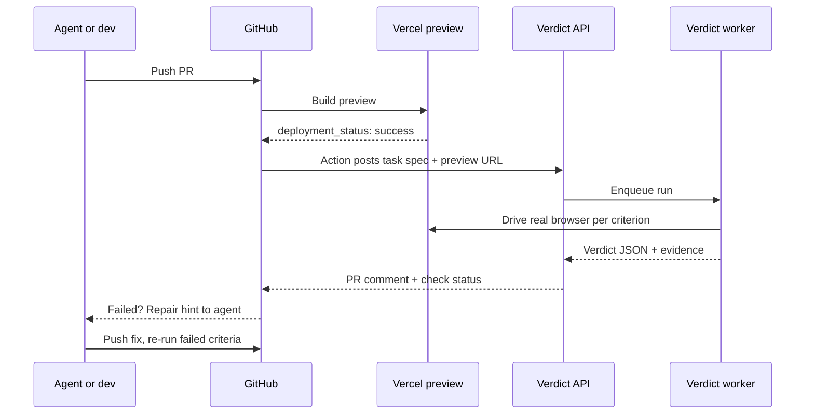
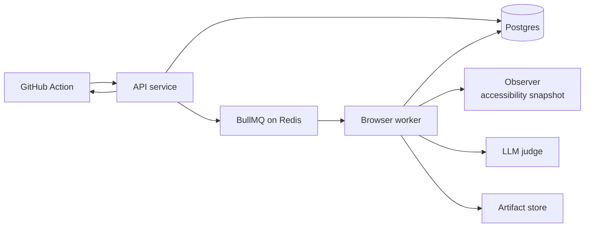

# PRD — Verdict: Browser Verification Executor for Alan

22 Sept 2026 · Tanishq Mohod

> Product requirements. Changes agreed after reading EventPulse's code are listed in `docs/PLAN.md` → "Changes to the PRD". Where the two differ, PLAN.md wins.

## Overview

Verdict is a browser-verification executor: it opens a pull request's preview deploy in a real browser, checks it against the task's acceptance criteria, and returns a structured verdict a coding agent can act on. It is built as a candidate project for the SDE Intern role at Alan, with EventPulse as the demo target.

**The problem.** Alan's own framing: coding agents produce changes faster than QA can verify them, so testing becomes the step everything waits on. A green CI run proves the code compiles and unit tests pass, not that the feature behaves as the task intended.

**The answer.** Verdict makes behavioral QA a step inside the agent loop instead of a queue at the end: verify, diagnose, hand back a repair hint, re-run. It is an executor, not a platform. It takes a task, runs it, and returns a result for an orchestrator like Alan to route and store.

## Goals, non-goals, and success metrics

Verdict v1 succeeds if it catches at least 80% of seeded bugs on EventPulse while failing fewer than 10% of clean builds.

### Goals
- Return a per-criterion verdict for a 5-criterion task within 3 minutes at p95.
- Make every verdict evidence-backed and machine-readable, so an agent can repair from it without a human.
- Run automatically on every PR preview through a GitHub Action, and on demand through an HTTP API.
- Measure catch rate on a seeded-bug benchmark instead of claiming it.

### Non-goals for v1
- Replacing unit or integration test frameworks.
- Pixel-diff visual regression testing.
- Editing code. Verdict returns repair hints; the coding agent does the fix.
- Multi-tenant SaaS features: billing, orgs, dashboards.
- Mobile and native apps.

### Success metrics (targets, to be measured)

| Metric | Target | How it is measured |
|---|---|---|
| Catch rate | ≥ 80% | Seeded bugs detected across 3 runs each |
| False-fail rate | ≤ 10% | Clean main branch, 5 runs |
| Verdict stability | ≥ 90% identical | Same build, 3 reruns |
| Latency | ≤ 180 s p95 | 5-criterion task, end to end |
| Cost per run | ≤ $0.05 | LLM tokens per run, logged |

## Users and use cases

The primary consumer is a coding agent, not a person: Verdict's output is designed to be read by a machine first and skimmed by a human second.

| User | Needs from Verdict |
|---|---|
| Coding agent | A failing step, expected vs. observed behavior, and evidence it can repair from |
| Orchestrator (e.g. Alan) | A standard task-in, result-out interface it can route to and store |
| Engineer reviewing the PR | A PR comment that replaces the manual click-through |

### Use cases
1. **PR preview verification.** A PR deploys to a preview URL; Verdict checks the task's acceptance criteria and posts a verdict before any human reviews.
2. **Re-verify after repair.** The agent pushes a fix; Verdict re-runs only the failed criteria.
3. **On-demand runs.** An orchestrator calls the API with any URL and criteria.
4. **Nightly production smoke test (stretch).** The same criteria run against production on a schedule.

## How it works

A PR's preview deploy triggers a verification run, and the verdict lands on the PR as a comment and a check status within about 3 minutes.



The loop repeats until every criterion passes or a human steps in. Each run is keyed by repo, commit and spec hash, so a retried webhook never runs the same verification twice.

## System architecture

Verdict splits into a thin API that accepts jobs and a pool of browser workers behind a durable queue, so a slow or crashed browser never blocks new requests.



| Component | Responsibility | Key decisions |
|---|---|---|
| API service | Accept runs, auth, rate limits, return verdicts | Fastify + TypeScript; scoped API keys; idempotency key per run |
| Queue | Durable job handoff between API and workers | BullMQ on Redis; exponential backoff; dead-letter queue |
| Browser worker | Drive Chromium through each criterion | Playwright; fresh context per run; hard 5-minute timeout |
| Page observer | Turn a page into compact, structured context | Playwright accessibility snapshot: interactive elements with clickable references, visible text |
| LLM judge | Plan steps and judge each criterion | Provider-agnostic client; deterministic checks first, LLM second |
| Artifact store | Screenshots and Playwright traces | S3-compatible (Supabase Storage); signed URLs, 14-day retention |
| Postgres | Runs, criteria, verdicts, cost | Prisma schema; one row per criterion result |
| GitHub Action | Trigger on preview deploy, post results | Reads .verdict.yml, sets a check status, posts one PR comment |

## Interfaces

Verdict has one input (a task spec) and one output (a verdict), and both are versioned JSON schemas validated with zod at every boundary.

**Task spec** — lives in the repo as `.verdict.yml`, or is sent inline to the API:

```yaml
version: 1
task: ENG-204 Ticket booking
base_url: ${PREVIEW_URL}
auth:
  email: ${{ secrets.VERDICT_TEST_EMAIL }}
  password: ${{ secrets.VERDICT_TEST_PASSWORD }}
criteria:
  - id: book-ticket
    check: A logged-in user can book one ticket for "Demo Night" and sees a confirmation.
  - id: seat-count
    check: After booking, the remaining seat count for "Demo Night" drops by exactly 1.
  - id: sold-out
    check: When an event is sold out, the Book button is disabled and no booking is created.
limits:
  max_steps_per_criterion: 15
  timeout_seconds: 300
```

**Verdict** — returned by the API and posted to the PR:

```json
{
  "run_id": "run_8f2c",
  "status": "fail",
  "commit": "a1b2c3d",
  "summary": { "passed": 2, "failed": 1, "error": 0, "inconclusive": 0 },
  "criteria": [
    {
      "id": "seat-count",
      "result": "fail",
      "expected": "Remaining seats drop from 40 to 39",
      "observed": "Remaining seats still show 40 after confirmation",
      "failing_step": 6,
      "evidence": {
        "screenshot_url": "https://.../run_8f2c/seat-count-step6.png",
        "trace_url": "https://.../run_8f2c/trace.zip",
        "console_errors": [],
        "failed_requests": []
      },
      "repair_hint": "Booking succeeded (201) but the event page shows a stale count. Check cache invalidation or the seat-count query after booking."
    }
  ],
  "cost": { "llm_tokens": 18430, "usd": 0.031 },
  "duration_ms": 97400
}
```

Results take four values: `pass`, `fail`, `error` (Verdict or infrastructure broke, not the app), and `inconclusive` (the agent could not reach a decision within its step budget). Separating `error` from `fail` is what keeps the agent from "fixing" bugs that are really Verdict's.

### HTTP API

| Method | Path | Purpose |
|---|---|---|
| POST | /v1/runs | Start a run; body = task spec + URL; Idempotency-Key header |
| GET | /v1/runs/{id} | Run status and verdict |
| POST | /v1/runs/{id}/rerun | Re-run failed criteria only |
| GET | /v1/runs/{id}/artifacts | Signed URLs for screenshots and traces |
| GET | /healthz | Liveness for API, queue and database |

An optional `callback_url` on POST /v1/runs receives the verdict by webhook, signed with HMAC-SHA256, so an orchestrator never has to poll.

**GitHub Action** — triggered by `deployment_status` with state `success`. Inputs: `api-key`, `spec-path` (default `.verdict.yml`), `fail-on` (`fail` or `fail,inconclusive`). It sets a Verdict check status and updates a single PR comment in place instead of posting a new one per run.

## Verification engine

Each criterion runs as a bounded observe–act–judge loop, and deterministic checks decide before the LLM is ever asked, which is what keeps verdicts stable across reruns.

### The loop, per criterion
1. **Observe.** Playwright's accessibility snapshot captures the page as compact, structured text: interactive elements with references the executor can click, and visible text. Screenshots are kept as evidence, not sent to the model.
2. **Plan and act.** The LLM picks the next action from a closed set: navigate, click, type, select, wait_for, assert. Playwright executes it. No free-form code execution.
3. **Judge.** Once the criterion's end state is reached, Verdict decides pass or fail, then records the evidence at that exact step.
4. **Stop.** The loop ends on a decision, on max_steps_per_criterion (default 15), or on the run timeout, whichever comes first.

### Hybrid judging, in order of trust

| Signal | Example | Decides alone? |
|---|---|---|
| Network | Booking POST returns 500 | Yes, fail |
| Console | Uncaught TypeError on click | Yes, fail |
| DOM assertion | Seat count text reads "39" | Yes, pass or fail |
| LLM judgment | "Confirmation clearly shown" | Only when the signals above are silent |

The LLM translates a plain-English criterion into concrete assertions where it can ("seat count drops by 1" becomes read, act, read again, compare). It only judges directly when no assertion fits.

**Evidence captured for every criterion:** a screenshot at the decision step, the full step trace, console errors, failed network requests, and a Playwright trace file for replay.

### Flake handling
- A transient step failure (element detached, navigation race) retries once after a short wait.
- A failed criterion re-runs once in a fresh browser context before it is reported as fail.
- Two disagreeing results on the same build are reported as inconclusive, never silently picked.

Repair hints combine the failing step, expected vs. observed behavior, and the strongest signal found (the failed request, the console error, or the stale DOM value), phrased so an agent knows where in the codebase to look.

## Reliability, security, and observability

Verdict drives a real browser against untrusted pages with test credentials, so isolation and secret handling are requirements, not polish.

### Reliability
- **Idempotency.** Each run is keyed by repo, commit SHA and spec hash; a duplicate webhook returns the existing run instead of starting a new one.
- **Durable jobs.** BullMQ retries with exponential backoff (3 attempts); exhausted jobs land in a dead-letter queue with the error attached.
- **Crash recovery.** Workers hold a job lease; if a worker dies mid-run, the lease expires and the job is retried once, then marked error.
- **Hard limits.** 5-minute run timeout, 15 steps per criterion, 10 criteria per spec.

### Security
- Scoped API keys, one per repo, stored hashed; rate-limited per key.
- Secrets (test-account credentials) come from GitHub secrets, are injected only into the browser session, and are redacted from logs, traces and LLM prompts.
- Sandboxed browsers. A fresh Chromium context per run, no persistent storage, killed on timeout.
- Egress allowlist. The worker only navigates to the preview URL's host and its declared API hosts, which prevents Verdict being used to reach internal networks.
- Prompt-injection defense. Page text is passed to the LLM as data inside delimited blocks, and the system prompt forbids following instructions found in page content. Only the closed action set can execute.
- Signed callbacks. Webhook deliveries carry an HMAC-SHA256 signature and a timestamp to block replays.

### Observability
- Structured JSON logs tagged with run_id and criterion_id.
- OpenTelemetry trace per run, with one span per step.
- Metrics: run latency, pass/fail/error/inconclusive rates, LLM tokens and USD per run, queue depth.
- Playwright trace files for every failed criterion, replayable locally with `npx playwright show-trace`.

## Evaluation: seeded-bug benchmark

Verdict's headline number is its catch rate on six bugs seeded into EventPulse, each on its own branch and preview deploy, measured against clean builds for false fails.

| Bug | What breaks | Criterion that should catch it | Signal expected |
|---|---|---|---|
| B1 | Book button throws a JS error | book-ticket | Console |
| B2 | Seat count not decremented after booking | seat-count | DOM assertion |
| B3 | Sold-out event still accepts bookings | sold-out | DOM + network |
| B4 | Checkout shows the wrong price | price-matches | DOM assertion |
| B5 | QR ticket page returns 500 | ticket-qr | Network |
| B6 | Login redirects in a loop | book-ticket (auth step) | Step budget + URL |

### Procedure
1. Push each bug on its own branch so Vercel builds six separate previews.
2. Run Verdict 3 times per bug preview: 18 runs.
3. Run Verdict 5 times against clean main: the false-fail baseline.
4. Record per run: detected (yes/no), which criterion caught it, result type, latency, tokens and cost.

Reported as: catch rate (bugs detected in at least 2 of 3 runs, out of 6), false-fail rate on clean runs, verdict stability, p50 and p95 latency, and average cost per run. Results go into the README as a table, with the raw run log committed to `bench/results/`.

B3 is the one that matters most for the story: overselling under a sold-out state is the exact correctness bug EventPulse was built to prevent, and CI unit tests would not catch it on a preview.

## Tech stack and repository structure

Verdict is TypeScript end to end so the API, worker and GitHub Action share one set of types, with every piece runnable locally through one `docker compose up`.

| Layer | Choice | Why |
|---|---|---|
| Language | TypeScript on Node 20 | Strict types shared across API, worker and Action |
| API | Fastify + zod | Fast, schema-first request validation |
| Queue | BullMQ on Redis | Retries, backoff, DLQ out of the box |
| Database | Postgres + Prisma | Typed queries, migrations |
| Browser | Playwright (Chromium) | Traces, auto-waiting, stable selectors |
| Context | Playwright accessibility snapshot | Compact page context with clickable element references |
| LLM | Provider-agnostic client (Anthropic or OpenAI) | Swappable model; cost logged per call |
| Storage | Supabase Storage | S3-compatible, signed URLs |
| Tests | Vitest + Playwright test | Unit tests plus the benchmark suite |
| CI/CD | GitHub Actions; Docker images | Same images locally and in production |
| Hosting | API and worker on Fly.io or Render | Always-on workers with enough memory for Chromium |

```text
verdict/
├── apps/
│   ├── api/              # Fastify: routes, auth, rate limits, idempotency
│   └── worker/           # BullMQ consumer: browser loop, judging, evidence
├── packages/
│   ├── schema/           # zod: task spec + verdict (shared, versioned)
│   ├── engine/           # observe–act–judge loop, hybrid judging, flake handling
│   ├── llm/              # provider-agnostic client, prompts, cost tracking
│   └── github/           # check status + single PR comment updater
├── action/               # GitHub Action (action.yml + entrypoint)
├── bench/
│   ├── bugs/             # B1–B6 patch files for EventPulse
│   ├── run.ts            # benchmark runner
│   └── results/          # raw run logs + summary table
├── prisma/schema.prisma
├── docker-compose.yml    # api, worker, postgres, redis
├── .verdict.example.yml
└── README.md             # demo GIF, benchmark table, architecture, quickstart
```

The README is the product page: a 20-second GIF of a verdict landing on a PR, the benchmark table, the architecture diagram, and a 3-command quickstart.

## Milestones and demo

The first shippable version takes four working sessions.

**Milestone 1 — one criterion, locally (night 1)**
- [ ] Monorepo scaffold, zod schemas for task spec and verdict
- [ ] Worker runs Playwright against EventPulse's preview URL
- [ ] Observe–act–judge loop decides one criterion (book-ticket) and prints verdict JSON

**Milestone 2 — full engine and API (night 2)**
- [ ] Multiple criteria, hybrid judging, evidence capture, flake handling
- [ ] Fastify API + BullMQ queue + Postgres; idempotency key; artifact upload
- [ ] Docker compose runs the whole stack with one command

**Milestone 3 — GitHub loop (night 3)**
- [ ] GitHub Action on deployment_status; check status; single updating PR comment
- [ ] Re-run failed criteria only
- [ ] Deploy API and worker (Fly.io or Render)

**Milestone 4 — prove it (day 4)**
- [ ] Seed B1–B6, run the benchmark, commit results
- [ ] README with GIF, benchmark table, architecture, quickstart
- [ ] 2-minute demo video

### Demo script (2 minutes)
1. 0:00–0:15 — The problem in one line: agents ship code faster than anyone can verify it.
2. 0:15–0:45 — Open a PR on EventPulse with bug B3 (sold-out event still bookable). The preview deploys, and the Verdict check turns red.
3. 0:45–1:15 — The PR comment: failing criterion, expected vs. observed, the screenshot, the repair hint.
4. 1:15–1:40 — Push the fix. Verdict re-runs only that criterion and turns green.
5. 1:40–2:00 — The benchmark table (catch rate, false fails, cost per run) and how it would plug into Alan's verify step.

## Risks and open questions

The biggest risk is flaky LLM judgment, and the design answers it by letting deterministic signals decide first and reporting disagreement as inconclusive.

| Risk | Impact | Mitigation |
|---|---|---|
| LLM judge flips between runs | False fails erode trust | Hybrid judging; one fresh-context rerun; disagreement becomes inconclusive |
| Auth-gated flows break the agent | Criteria can't be reached | Seeded test account via secrets; login as a reusable first step |
| Preview URL not ready when the run starts | Spurious error results | Trigger on deployment_status: success; health-check the URL before starting |
| LLM cost grows with page size | Cost target missed | Compact accessibility snapshot instead of raw HTML; per-run token cap |
| Scope creep past 4 sessions | Nothing ships | Non-goals are fixed; anything new goes to a v2 list |

### Open questions
- Does Alan expose an executor interface? Unknown from public material, so Verdict keeps its API generic (task in, verdict out) and adapts once the real shape is known.
- Which LLM gives the best judgment per dollar? Measure two providers on the benchmark instead of guessing.
- Should criteria be generated from the PR description or ticket automatically? Out of scope for v1; strong v2 candidate given Alan's shared-context layer.

Sources: Alan — the control plane for software delivery
